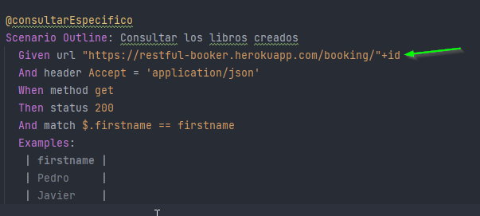

# Proyecto automatizacion karate

Pre-requisitos
- JDK version 1.8.0
- Gradle 7.4
- Entorno de desarrollo IntelliJ IDEA
- Git

Estructura del proyecto
- books.feature: se encuentra los escenarios de cada uno de los endpoint
para ejecutarsen en un unico test con el tag @runnerGeneral
- books-especificos.feature: se encuentran los escenarios para que puedan ser
ejecutados de manera independiente.

nota: para que funcionen correctamente es necesario cambiar el campo id por
el id que se desea consumir

Instrucciones de ejecucion
1. Clonar el proyecto del repositorio https://github.com/jhonsb77/libros-karate.git mediante el comando git clone en la carpeta deseada de su equipo
2. En el etorno de desarrrollo, seleccionar la opcion "File" y posteriormente la opcion "Open". Alli seleccionara el proyecto guardado en la ruta del paso anterior
3. Esperar a que el proyecto se configure y descargue las dependecias, si esto no se realiza, en el archivo "build.gradle" seleccionar la opcion "reload all gradle projects"
4. Seleccionar el archivo BooksRuner para ejecutar todo el set de pruebas o
seleccionar el archivo BooksRunnerEspecifico para ejecutar un escenario deseado ingresando el tag correspondiente

Reportes
- reporte de karate: /target/karate-reports/karate-summary.html
- reporte cucumber: /build/cucumber-html-reports/overview-features.html